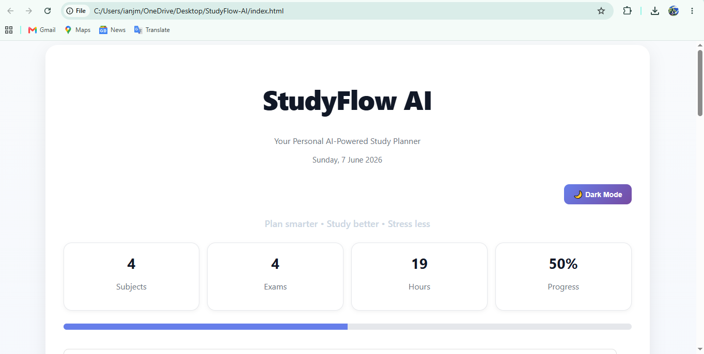
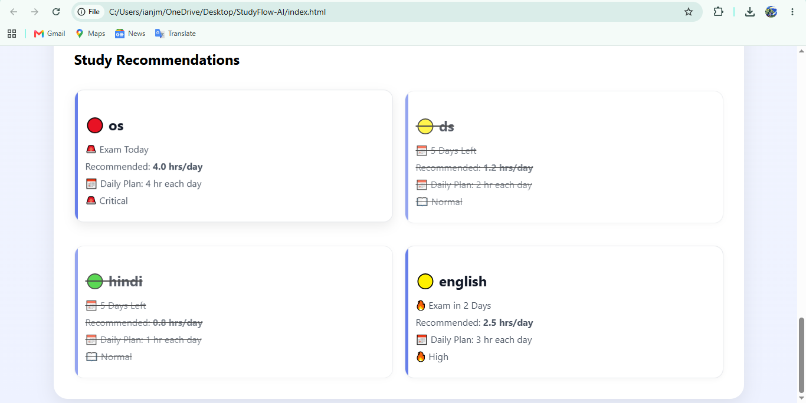

# 📚 StudyFlow AI

StudyFlow AI is a smart study planning web application that helps students organize their exam preparation efficiently.

The application generates personalized study recommendations based on exam dates, study hours required, and priority levels while tracking overall progress.

---

## ✨ Features

### 📋 Task Management
- Add subjects and exam dates
- Set required study hours
- Assign priority levels (High, Medium, Low)
- Delete tasks when completed

### 🎯 Smart Study Recommendations
- Calculates recommended study hours per day
- Generates daily study plans
- Shows exam countdowns
- Displays urgency indicators

### 📊 Progress Tracking
- Mark tasks as completed
- Visual progress bar
- Completion percentage tracking

### 📈 Dashboard Analytics
- Total Subjects
- Upcoming Exams
- Total Study Hours
- Overall Progress

### 🌙 Dark Mode
- One-click dark mode support

### 📄 PDF Export
- Export study plan as PDF
- Includes:
  - Subject name
  - Exam date
  - Hours needed
  - Priority
  - Recommended study hours/day

### 💾 Local Storage
- Automatically saves tasks
- Data remains after refreshing or reopening the browser

---

## 🛠️ Tech Stack

- HTML5
- CSS3
- JavaScript
- Local Storage API
- jsPDF

---

## 📸 Screenshots

### Dashboard

### Dark Mode

### Study Recommendations

### PDF Export

---

## 🚀 How To Run

1. Download or clone the repository.
2. Open the project folder.
3. Open `index.html` in any browser.
4. Start planning your studies.

---

## 🔮 Future Scope

- AI-powered study scheduling
- Calendar integration
- Reminder notifications
- User authentication
- Cloud synchronization
- Mobile application version

---

## 👩‍💻 Author

**Khushi Bhardwaj**

Built for learning, productivity, and smarter exam preparation.

---
